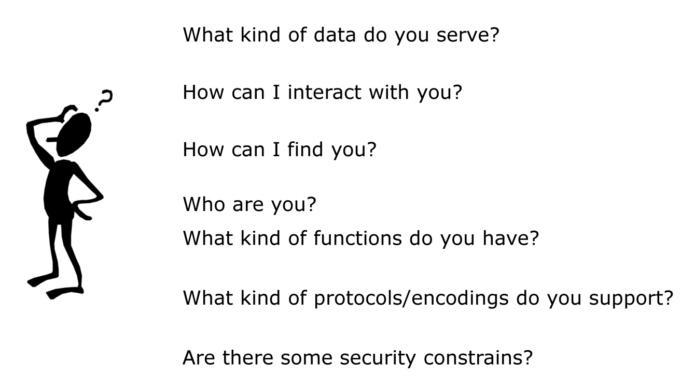
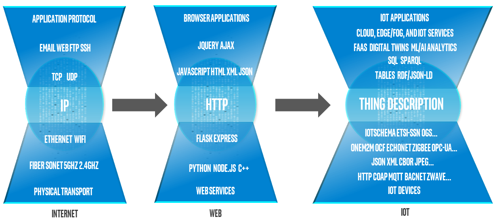
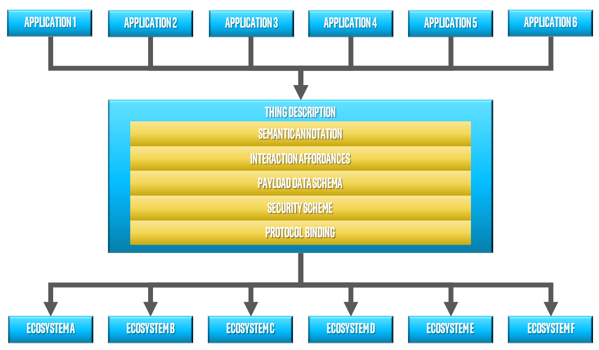

# WoT Thing Description (TD) Explainer

[//]: # (What role does the TD specification play in the WoT?)

[//]: # (A brief, 4-5 paragraph explanation of the feature’s value. Outline what the feature does and how it accomplishes those goals in prose. If your feature creates UI, this is a great place to show mocks and user flows.)

[//]: # (The W3C Web of Things [WoT] is intended to enable
interoperability across IoT Platforms and application domains using Web technology.)

In the [WoT architecture](https://w3c.github.io/wot-architecture/index.html), 
a Thing is defined as an abstraction of an IoT device or service.
The Thing Description (TD) provides descriptive metadata for a Thing.
TDs supports interoperability between Things (and applications that use Things)
by describing how Things manifest their *Interaction Affordances*
(i.e. properties, actions and events) to clients,
using Web technologies such as Hypermedia controls (links, forms, etc.)
and Media Types.

With a TD,
clients are informed of the choices they can make when interacting with Things.
This can drive applications in the same way that Web HTML pages allow users to
make choices when navigating the Web and drive Web applications
through links and forms.

Through use case analysis and PlugFest activities in the WoT Interest Group, 
the group determined that 
in order to enable interoperabilty
such a metadata manifest has 
to answer questions such as the ones shown in the figure below.
The WoT Working Group formalized the TD specification
to contain this information.



The figure below (from the WoT Architecture document) 
shows the WoT building blocks and
how they relate to four key architectural aspects of a Thing.
Each building block,
identified in the WoT WG's charter,
is concerned with addressing specific interoperability issues. 


TDs are a WoT building block that consolidates metadata related
to several of different architectural aspects of Things.
TDs provide information about the *Interaction Affordances* of Things,
public security metadata, and payload data schemas. 
They also provide other
metadata, such as the name, description, 
and (optionally) semantic annotations for a Thing. 
TD generally enable interoperability at the network interaction level.

Other building blocks that address other interoperability challenges are:
- The *WoT Scripting API* 
  provides a JavaScript programming interface
  as a way to ease developer's work of
  implementing *Application behavior*.
  the WoT Scripting API also provides a convenient way
  to produce and "Expose" Thing Descriptions
  as well as read and parse ("Consume") other Thing's Thing Descriptions.
- *Security* is another key building block, but is also a cross-cutting concern.
  TDs consolidate the public metadata that describes the security mechanisms
  and other requirements necessary to access a Thing.
  Well-established security schemes are directly supported
  as part of the core *Thing Description* vocabulary.
  Additional security schemes can be supported as extensions.
- *Protocol Binding Templates* describe how concrete protocols
  are mapped to the abstract terms and operations
  used to define interaction affordances
  in the *Thing Description* specification.

## How does the TD contribute to IoT Interoperability? 

In the modern internet the IP (Internet Protocol) standard
forms what is called a "narrow waist". 
IP serves as a focal abstraction point.
A diverse set of
upper-level networking and application layers can depend on 
the functionality provided by IP 
regardless of what lower level link and physical mechanisms
are actually being used to implement the network.
At the application level, 
the HTTP likewise provides a narrow waist for
many different web applications,
both M2H (browsers and web pages) 
and M2M (web services).
Many different applications can depend on the functionality
provided by HTTP and services based on it 
independent of the technology used on the 
servers to provide that functionality.
The narrow waist model is generally considered a significant contributing 
factor to the success of both the internet and the web.

Many IoT ecosystems have been developed in silos, with
solutions unique application domain.
Currently in the IoT each application domain is likely already using one or more
standards unique to that domain and ecosystem.
This fragmentation is a serious problem in building cross
industry domain IoT applications.
Even worse, many IoT devices already deployed cannot be easily
converted to a different standard,
even if everyone agreed to one;
this is known as the "brownfield" problem.

In order to acheive IoT interoperabilty,
there is a corresponding need for a narrow waist.
This narrow waist does not seem to be currently acheivable in the IoT
at the level of concrete protocols.
However, the key observation of the WoT is that to acheive
interoperability, what we really need is a common *abstraction layer* to
separate low-level concerns from high-level applications.



The Thing Description (TD) addresses the IoT ecosystem fragmentation problem
not by defining yet another low-level protocol,
but by providing a common set of abstractions and
a metadata framework to describe IoT services in terms of those abstractions.
Rather than providing interoperability at the protocol level,
provides a narrow waist at the level of metadata.

In the figure below, even though different IoT ecosystems employ different protocols,
payloads and security schemes, the TD provides a common abstraction that
applications can build upon.
Cross-domain applications that span multiple ecosystems can be developed by
interacting with IoT services and devices 
according to the description given in the TDs,
regardless of the number of ecosystems involved.
Systems using a TD can interact with services using the abstraction provided by 
the TD, rather than by the concrete protocol.
Translations from the higher level of abstraction provided in the TD 
to lower-level protocols can be provided automatically.

We assume the consumer of an IoT service adapts to the target service's
concrete protocol using the information provided in the TD.
Although specialized translation or proxy services _can_ be used, this is not
_necessary_; applications can use the information provided in the TD to talk
to an endpoint device directly.
Rather than build _O(N^2)_ translators to interconvert between _N_ protocols,
this direct model requires only that applications be able to communicate
using the abstractions provided in the TD combined with a set of _N_ protocol
adapters.
A protocol translation approach can still be used, in fact is
enabled by the metadata in the TD 
(such a translator could consume one TD and expose another
in a different concrete protocol), and is useful in many cases.
However, again, protocol translation is not a _requirement_ 
for interoperability itself in the WoT architecture.


Applications also often use different terminologies in their data models.
This again tends to lead to an _O(N^2)_ translation cost 
when those applications want to talk to each other.
Semantic Web technology can be used to address this issue.
TDs embrace Semantic Web technologies:
Semantic annotations can be added to various elements in TD instances,
enabling applications to understand other applications' data by applying
semantic processing.



## Goals of the Thing Description (TD) 

According to the 
[WoT Working Group Charter](https://www.w3.org/2016/12/wot-wg-2016.html), 
the goals of the Thing Description (TD) are to:

- describe Things through metadata and declarations of their capabilities
  (e.g., possible interactions); and
- include the definition of *machine-understandable vocabulary sets*,
  where the vocabulary sets include:
  - a common vocabulary for describing Things in terms of the data
    and interaction models they expose to and/or consume from applications
    (e.g., interaction patterns such as Properties, Actions, and Events);
  - a common vocabulary for security and privacy metadata 
    as a basis for platforms to determine how to securely interoperate; and
  - a common vocabulary for communications metadata.

At the same time, the TD has to pay attention to the following requirements:

- For basic usages there must not be an explicit dependence on RDF,
  to avoid any need for constrained systems to perform explicit semantic processing.
- To enable more complex usages,
  the TD must still however include extension points
  to allow the use of semantic vocabularies and tools
  (e.g., Linked Open Data, Schema.org,
  Resource Description Framework (RDF), semantic reasoners, etc..).

These last two goals are naturally somewhat in conflict, but as will
be described, the specification simply provides a
set of core functionality that does not require RDF.
However, TDs still support an information model that can be used with RDF
when it is useful,
while
optional extension points support semantic annotation.

### Non-Goals of Thing Description (TD)

The following are explictly NOT goals of the TD specification:

- Application- and domain-specific metadata vocabularies.
   - TDs support the use of domain-specific vocabularies,
     but no domain-specific vocabularies are defined as part of the specification.
- Modification of existing protocols or security mechanisms.
- Specification on new protocols or security mechanisms.
   - TDs are meant to describe existing practice, not prescribe new practices.

TDs are also limited to protocols that have resources and access points that can
be described with URLs and to payload types that have an IANA media Type.
Structured payloads are supported but should be
conceptually interconvertible with JSON.

## What is inside the Thing Description (TD) specification

The draft TD specification is
[available for review](https://w3c.github.io/wot-thing-description/).

This specification primarily defines the TD Information Model
and the TD Serialization as JSON:

- **[TD Information Model](https://w3c.github.io/wot-thing-description/#sec-vocabulary-definition)** (Section 5)

  The Thing Description Information model serves as the conceptual basis
  for the serialization and processing of a Thing Description. 
  It consists of the four vocabularies listed below: 

  - [**Core Vocabulary**](https://w3c.github.io/wot-thing-description/#sec-core-vocabulary-definition)

    TD Information Model's core vocabulary includes terms for: 
      - *[Thing](https://w3c.github.io/wot-thing-description/#thing)*, 
      - *[Interaction Affordance](https://w3c.github.io/wot-thing-description/#interactionaffordance)*, 
      - *[Form](https://w3c.github.io/wot-thing-description/#form)*, 
      - *[Version Information](https://w3c.github.io/wot-thing-description/#versioninfo)*, 
      - *[Expected Response](https://w3c.github.io/wot-thing-description/#expectedresponse)* 
        (media type of response messages), and
      - *[Multi Language](https://w3c.github.io/wot-thing-description/#multilanguage)* 
        (Container to provide human-readable text in different languages).
  - [**Data Schema Vocabulary**](https://w3c.github.io/wot-thing-description/#sec-data-schema-vocabulary-definition)
      - Vocabulary for Data Schema definitions of 
        both scalar and structured payload data.
  - [**Security Vocabulary**](https://w3c.github.io/wot-thing-description/#sec-security-vocabulary-definition)
      - Vocabulary of well-established security mechanisms considered appropriate to be built-in in TD Information Model.
  - [**Web Linking Vocabulary**](https://w3c.github.io/wot-thing-description/#sec-web-linking-vocabulary-definition)
      - Vocabulary for web links exposed by a Thing. 
      - The Web Linking Vocabulary, modeled after the CoRE Link format,
        is in its own namespace for modularity.

The TD Information Model borrows two keywords from JSON-LD, `@context` and `@type`,
as extension points in order to allow the use of semantic vocabularies and tools.

- **[TD Serialization](https://w3c.github.io/wot-thing-description/#sec-td-serialization)** (Section 6)
   - Describes the serialization of instances of TD Information Model.
   - Serialization of TD is in JSON. 
   - There is an (informative) [JSON Schema](https://w3c.github.io/wot-thing-description/#json-schema-4-validation) 
     provided for TD serialization that can be used for validating TD instances.

In light of the Open-World assumption used by RDF,
and to allow TDs to be easily converted to RDF and support extensions,
the TD Serialization defines two classes of TD serialization,
the "Simple Thing Description" and the "Full Thing Description". 
In a Simple Thing Description elements with default values can be omitted,
even if they are technically mandatory in the information model.
Full Thing Description instances must include all mandatory vocabulary terms
defined in the specification;
values are present even when there are default values defined
in TD specification. 
In particular, 
a Full Thing Description instance always at least contains an `@context` value 
at the 
[Thing](https://w3c.github.io/wot-thing-description/#sec-thing-as-a-whole-json) level.

The Full Thing Description enables semantic processing,
such as that supported by RDF tools. 
The TD specification also defines its own 
[Transformation to JSON-LD & RDF](https://w3c.github.io/wot-thing-description/#note-jsonld10-processing) 
rules (in an Appendix) for transforming TD instances into a form (JSON-LD 1.0 & RDF) 
adequate for feeding into such tools.
The syntax of the TD is also aligned with the current JSON-LD 1.1 draft but cannot
be considered a JSON-LD 1.1 document as that standard is not yet final.

## Important Design Choices

This section summarizes a number of design choices that the WoT Working Group
spent a considerable amount of time debating.

### No Direct TD Serialization Using JSON-LD 1.0

An early design considered for the WoT Thing Description based it
directly on JSON-LD 1.0.
This had several advantages including easy integration
with RDF-based semantics processors.
TDs stored in RDF databases could also be re-serialized as valid TDs.

Unfortunately the syntax of JSON-LD 1.0 is fairly restrictive and this led to a
syntax which was verbose and was considered confusing by many of the web developers 
we consulted with.

The current proposal uses a more straightforward and "natural" JSON serialization
which we are however attempting to align with the current JSON-LD 1.1 proposal.

### TD Serialization's Relationship to JSON-LD 1.1

Currently the TD specification only defines a JSON serialization.

However, the WoT Working Group has been talking with the JSON-LD WG
regarding missing features in JSON-LD 1.1 needed for implementation of the
current TD specification directly using JSON-LD 1.1.
The discussion is ongoing in [GitHub](https://github.com/w3c/json-ld-api/issues/65).

In particular, while JSON-LD 1.1 supports the use of the same name in
different contexts as described in
[Scoped Context](https://w3c.github.io/json-ld-syntax/#scoped-contexts),
the WoT Working Group's understanding is that although the feature is helpful,
it still does not fully address what TD Serialization needs to support a
"natural" JSON serialization acceptable to web developers.

The issue essentially means that if the TD were treated as a JSON-LD 1.1 document,
it will not round-trip to the same TD in JSON-LD 1.1 format.

This is a problem in implementing common WoT use cases in which TDs are
stored in a Thing Directory in the form of RDF to allow for
semantics-based Thing discovery,
while TDs can be served from the Thing Directory
in the form of TD after transforming back to the original form.

For this reason,
TD Serialization uses the JSON format,
and it is technically not in the JSON-LD 1.1 format.
If the requirements WoT Working Group presented to JSON-LD Working Group
are addressed and implemented in JSON-LD 1.1 draft specification as a stable feature,
the WoT WG will be able to say the TD conforms to JSON-LD 1.1 format.

### Communications Metadata Defined Using External Vocabularies

TD specification does not define communications metadata.
TD instances must use external vocabularies such as 
the [HTTP Vocabulary in RDF 1.0](https://www.w3.org/TR/HTTP-in-RDF10/)
to identify methods and options for particular concrete protocols (such as HTTP).
See more on the WoT WG Note 
[Web of Things (WoT) Protocol Binding Templates](https://w3c.github.io/wot-binding-templates/).

The reason for this decision is to simplify the extension of the TD
specification to additional concrete communication protocols in the future.

## Example

To make the discussion concrete, here is an example TD for an IoT-enabled lamp.
An explanation follows the example:

```json
{
    "@context": [
        "http://w3.org/ns/td",
        { "saref": "https://w3id.org/saref#" },
        { "htv": "http://www.w3.org/2011/http#" }
    ],
    "@type": [ "Thing", "saref#LightingDevice" ],
    "id": "urn:dev:wot:com:example:servient:lamp",
    "name": "MyLampThing",
    "securityDefinitions": {
        "basic_sc": {"scheme": "basic", "in":"header"}
    },
    "security": ["basic_sc"],
    "properties": {
        "status" : {
            "@type": "saref#OnOffState",
            "readOnly": true,
            "writeOnly": false,
            "observable": false,
            "type": "string",
            "forms": [{
                "href": "https://mylamp.example.com/status",
                "contentType": "application/json",
                "htv:methodName": "GET",
                "op": "readproperty"
            }]
        }
    },
    "actions": {
        "toggle" : {
            "@type": "saref#ToggleCommand",
            "idempotent": false,
            "safe": false,
            "forms": [{
                "href": "https://mylamp.example.com/toggle",
                "contentType": "application/json",
                "htv:methodName": "POST",
                "op": "invokeaction"
            }]
        }
    },
    "events":{
        "overheating":{
            "data": {"type": "string"},
            "forms": [{
                "href": "https://mylamp.example.com/oh",
                "contentType": "application/json",
                "subprotocol": "longpoll",
                "op": "subscribeevent"
            }]
        }
    }
} 
```

By reading the above example TD, 
one can obtain knowledge about the Thing named `MyLampThing`,
including the following:

- The Thing provides one Property interaction resource with the name `status`.
  - The property `status` is accessible via the HTTP protocol
    with a GET method at URI `https://mylamp.example.com/status`.
  - Reading the property `status` will return a string value.
  - This property is read-only;
    note that only a `readproperty` operation is available.
  - The `status` property resource is an instance of the
    SAREF ontology's `OnOffState` class.
- The Thing provides one Action interaction resource with the name `toggle`. 
  - The action `toggle` is accessible via the HTTP protocol
    with a POST method at URI `https://mylamp.example.com/toggle`.
  - The `toggle` action resource is an an instance of the
    SAREF ontology's `ToggleCommand` class.
  - The action is not idempotent:
    in general, repeating the action two or more times results in
    a different state than invoking it once.
  - The action is not safe (in a functional language sense):
    it has side effects that change the state. 
- The Thing provides one Event interaction resource with the name `overheating`.
  - The event `overheating` can be obtained at URI 
    `https://mylamp.example.com/oh` by using HTTP with a long polling sub-protocol.
    The subprotocol clarifies which of several possible mechanisms in HTTP
    are used to provide "push" notifications.
  - Each message pushed by the Thing is a string value.
- The Thing requires the use of HTTP Basic Authentication when 
  accessing all interaction resources.

Not shown in this example are the mechanisms included in TDs to
model structured data payloads and URI templates.  It is also
possible to use TDs to model Things that use different protocols
and security mechanisms for different interactions.

## Features at Risk

The specification itself contains highlights and notations
that indicate the details of features at risk due to
insufficient implementation experience.

In summary, the features currently at risk are:
* The APIKey, Cert, PSK, OAuth2, PoP, and Public security schemes.
* The `scopes` field in forms since it is only used with the OAuth2 security scheme.
* Certain options for security, such as proxy fields and some specialized options for some security schemes.

If two more more implementations for a security scheme, including examples that 
support and exercise all the options, are not available before PR transition
they will be removed but can be supported later via the extension mechanisms
included in the specification.
In fact, in order to support the addition of specialized options,
even the security schemes included in the specification may
also be used via the extension mechanism instead.

The following are included for completeness as less than
two implementations exist for these features.
However, these issues should be resolved before CR transition:
* URI templates;
* multilingual support for names, titles, and descriptions;
* use of `const` in data schemas and properties names (possible testing error); and
* use of `@context` and `@type` in DataSchema and SecurityScheme. 

## Implementations

Implementations were built by
Smart Things, ERCIM, Hitachi, Intel, Oracle, Panasonic, Fujitsu and Siemens.
Some organizations built more than one implementation;
in total 15 implementations were developed.
The [`node-wot`](https://github.com/eclipse/thingweb.node-wot)
implementation open-sourced by Siemens
via the Eclipse Foundation is one of the most complete
implementations and can be considered a "reference implementation".

Each implementation represents a working system with a distinct code base
that either exposes or consumes at least one WoT Thing Description.
In most cases multiple applications,
devices or services were developed with each implementation.
We refer to each of these as an "implementation instance".
Altogether there were 65 implementation instances submitted for testing.
Implementation instances that expose a Thing Description act as a
network server with an interface
as described in the Thing Description it exposes.
Implementations that consume a Thing Description act as a network
client and issue network
requests consistent with the target Thing Description.
In some cases a given implementation may be used for multiple Things
and a single Thing
may also act as both client and server on multiple interfaces.

