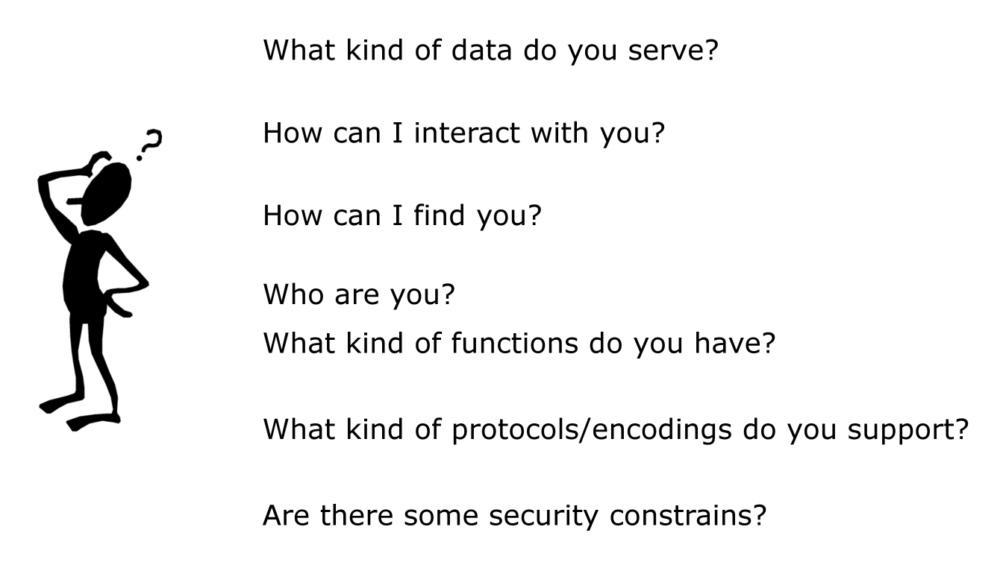
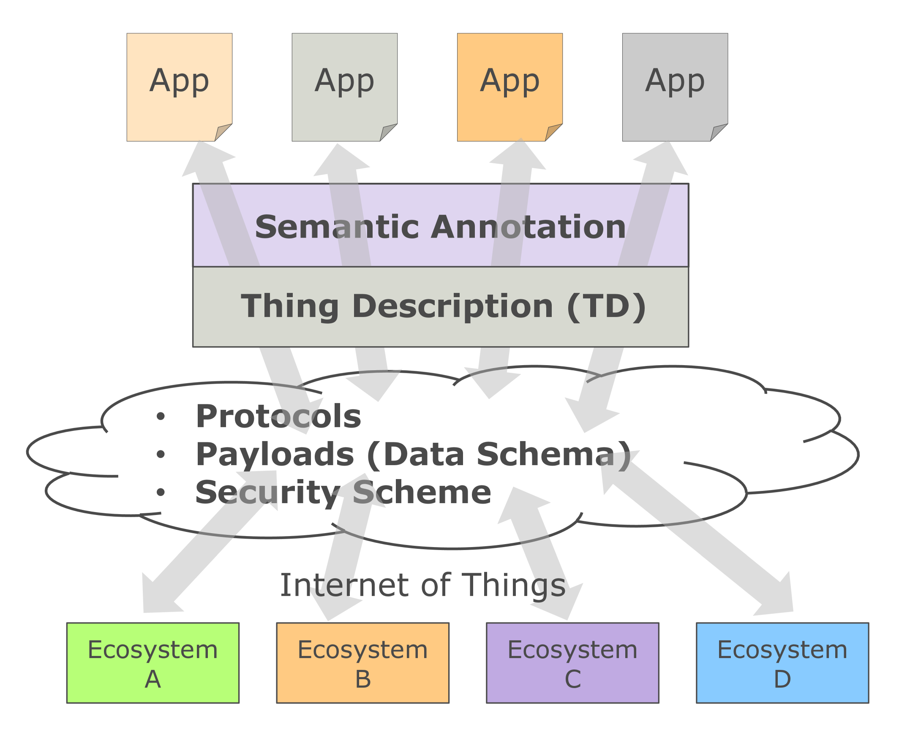

# WoT Thing Description (TD) Explainer

## What role does TD specification play in WoT?

The Thing Description (TD) specification is attempting to address the interoperability between Things (and applications that use Things) in how Things manifest their *Interaction Affordance* (i.e. properties, actions and events) to clients, using Web technologies such as Hypermedia controls (links, forms, etc.) and Media Types.  

With TD, the clients are informed of the choice to make in interacting with the Things and drive applications just as Web HTML pages let users to make choices in navigating the Web and drive Web applications through links and forms.

Through PlugFest activities in WoT Interest Group, the group learned that essentially such a manifest has to serve to answer questions such as the ones shown in the below figure. The WoT Working Group formalized this concept, and gave it the name Thing Description (TD) .

Below shows a figure borrowed from WoT Architecture document, showing the entire WoT building blocks. Each building block is concerned with addressing one of the four aspects of interoperability issues identified in the scope of the WoT WG's work for the current charter. 

As mentioned above, TD is about how to describe *Interaction Affordance*s of Things. Other building blocks are:

-  *Application behavior* that implements Application logic and manages Thing's lifecycle. *WoT Scripting API* provides a JavaScript programming interface as a way to ease developer's work of implementing *Application behavior*. 
- *Security Configuration* that describes security schemes required to access a Thing. Well-established security schemes are directly supported as part of the core *Thing Description* vocabulary. Other security schemes can be supported as extensions. 
- *Protocol Binding Templates* that describes how concrete protocols are mapped to abstract terms defined in *Thing Description* specification.

## How does TD contribute to IoT Interoperability? 

IoT connectivity frameworks such as *IIC (Industry Internet Consortium) connectivity stack*, have an hourglass shape, and the network layer (i.e. IP - Internet Protocol) is called a narrow waist, therein IP serves as a focal point where diverse lower level networking protocols are bound to IP, and all the upper layer can depend on IP regardless what lower networking protocols are actually used underneath. This hourglass model is generally considered a significant contributing factor in the success of the internet.

When we think about the situation where many IoT ecosystems are developed in silos, there is a need for a narrow-waist architecture for IoT ecosystem interoperability in order to avoid ending up in N-times-N translation gateway solution where N is the number of IoT ecosystems involved. This is a serious problem in building cross industry domain application in which each domain likely is using an ecosystem unique to the industry domain. 

Thing Description (TD) attempts bring an order to this IoT ecosystem fragmentation and address the interoperability issue by positioning itself as the narrow waist of the new hourglass interoperability architecture for IoT ecosystems. 

In the figure below, even though IoT ecosystems employs different protocols, payloads and security schemes, TD provides a common description system where the uniqueness of each ecosystem can be described in the same TD format. Therefore, cross-domain applications that spans across multiple ecosystems can be developed by interacting with ecosystems according to the description given in the TDs regardless of the number of ecosystems involved.

Applications, on the other hand, often use different terminologies in their data models. This again tend to end up in N-times-N translation between data models when those applications want to talk to each other. Semantic Web technology is known to help address this issue. TD embraces Semantic Web technologies by allowing semantic annotations to various elements in TD instances, enabling applications to understand other applications data by applying semantic processing.

## Goals of Thing Description (TD) 

According to the WoT Working Group [Charter](https://www.w3.org/2016/12/wot-wg-2016.html), the goals of Thing Description (TD) is:

- The Working Group will develop solutions to describe Things through metadata and declarations of their capabilities (e.g., possible interactions). 
- TD specification includes the definition of *machine-understandable vocabulary sets* as well as serialization formats, where the vocabulary sets include:
  - A common vocabulary for describing Things in terms of the data and interaction models they 
    expose to and/or consume from applications (e.g., interaction patterns such as Properties, Actions, and Events)
  - A common vocabulary for security and privacy metadata as a basis for platforms to determine how to securely interoperate.
  - A common vocabulary for communications metadata. 

At the same time, TD has to pay attention to the following requirements. 

- For basic usages there will not be an explicit dependence on RDF and it will not be necessary for constrained systems to perform explicit semantic processing.
-  To enable more complex usages, the TD will include extension points to allow the use of semantic vocabularies and tools (e.g., Linked Open Data, Schema.org, Resource Description Framework (RDF), semantic reasoners, etc..).

### Non-Goals of Thing Description (TD)

- Application- and domain-specific metadata vocabularies.
- Modification of existing protocols.

## What is inside Thing Description (TD) specification

The TD draft specification is available for review [here](https://w3c.github.io/wot-thing-description/).

What the specification defines primarily consists of the TD Information Model, and TD Serialization.

- **[TD Information Model](https://w3c.github.io/wot-thing-description/#sec-vocabulary-definition)** (Section 5)

  The Thing Description Information model serves as the conceptual basis for the serialization and processing of Thing. It consists of the four vocabularies listed below. 

  - [**Core Vocabulary**](https://w3c.github.io/wot-thing-description/#sec-core-vocabulary-definition)

    TD Information Model's core vocabulary that includes terms for: *[Thing](https://w3c.github.io/wot-thing-description/#thing)*, [*Interaction Affordance*](https://w3c.github.io/wot-thing-description/#interactionaffordance), *[Form](https://w3c.github.io/wot-thing-description/#form)*, *[Version Information](https://w3c.github.io/wot-thing-description/#versioninfo)*, *[Expected Response](https://w3c.github.io/wot-thing-description/#expectedresponse)* (media type of response messages), *[Multi Language](https://w3c.github.io/wot-thing-description/#multilanguage)* (Container to provide human-readable text in different languages).

  - [**Data Schema Vocabulary**](https://w3c.github.io/wot-thing-description/#sec-data-schema-vocabulary-definition)

    Vocabulary for Data Schema Definition for both scalar and structured data.

  - [**Security Vocabulary**](https://w3c.github.io/wot-thing-description/#sec-security-vocabulary-definition)

    Vocabulary of well-established security mechanisms considered appropriate to be built-in in TD Information Model.

  - [**Web Linking Vocabulary**](https://w3c.github.io/wot-thing-description/#sec-web-linking-vocabulary-definition)

    Vocabulary for Web links exposed by a Thing. 

    Web Linking Vocabulary, as modeled after CoRE Link format,  is in its own namespace for modularity.

  TD Information Model borrows two keywords from JSON-LD `@context` and `@type` as extension points in order to allow the use of semantic vocabularies and tools.

- **[TD Serialization](https://w3c.github.io/wot-thing-description/#sec-td-serialization)** (Section 6)

  Describes the serialization of instances of TD Information Model.

  Serialization of TD is in JSON format. There is a normative [JSON Schema](https://w3c.github.io/wot-thing-description/#json-schema-4-validation) provided for TD serialization that can be used for validating TD instances.

  In light of Open-World assumption, TD Serialization defines a class of TD serialization "Full Thing Description". Full Thing Description instances carry all mandatory vocabulary terms in the instances (i.e. values are present even when there are default values defined in TD specification.) Therefore, a Full Thing Description instance at least contains @context at the [Thing](https://w3c.github.io/wot-thing-description/#sec-thing-as-a-whole-json) level.

  Full Thing Description thus enables semantic processing such as by RDF tools. TD specification defines its own [Transformation to JSON-LD & RDF](https://w3c.github.io/wot-thing-description/#note-jsonld10-processing) rules in the Appendix for transforming TD instances into a form (JSON-LD 1.0 & RDF) adequate for feeding into semantic processing tools.

### What Else are There in Thing Description (TD) Specification?

TBD

## Important Design Choices

This section summarizes a number of design choices that the WoT Working Group spent a considerable amount of time debating.

### TD Serialization's relationship to JSON-LD 1.1

Note that the WoT Working Group has been talking with JSON-LD WG in regards to a missing feature in JSON-LD 1.1. The discussion is on-going in [HutGub](https://github.com/w3c/json-ld-api/issues/65). 

While JSON-LD 1.1 supports the use of the same name in different context as described in [Scoped Context](https://w3c.github.io/json-ld-syntax/#scoped-contexts), the WoT Working Group found that although the feature is helpful, it still does not fully address what TD Serialization needs. The issue essentially is that the RDF document transformed from JSON-LD 1.1 if TD were a JSON-LD 1.1 document, does not round-trip to the same TD in JSON-LD 1.1 format. 

For this reason, TD Serialization is in JSON format, and it is not in JSON-LD 1.1 format. When the requirements WoT Working Group presented to JSON-LD Working Group are addressed and implemented in JSON-LD 1.1 draft specification as a stable feature, WoT WG will be able to say TD conforms to JSON-LD 1.1 format. 

### Communications Metadata

TD specification does not define communications metadata. TD instances can use external vocabularies such as [HTTP Vocabulary in RDF 1.0](https://www.w3.org/TR/HTTP-in-RDF10/) to identify the methods and options. See more on the WoT WG Note [Web of Things (WoT) Protocol Binding Templates](https://w3c.github.io/wot-binding-templates/).

## Examples

TBD

## Features at Risk

TBD

## Implementations

TBD

