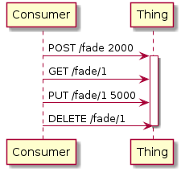

# Hypermedia Control on the Web of Things

This proposal introduces a generic hypermedia control framework for the Web of Things (WoT) that is similar to that of @vcharpenay but uses static TDs and focuses on action affordances.
The ideas were introduced also [at this comment](https://github.com/w3c/wot-thing-description/issues/302#issuecomment-627500213)

TL;DR:

- introduce new operation types `queryaction`, `updateaction`, `cancelaction`
- introduce new fields `query`, `update` and `cancel` to action affordances that map to payload information of `queryaction`, `updateaction` and `cancelaction`, respectively.
- `input` and `output` to each previously introduced terms

## Simple Action Example According to the Current Standard

The following interface allows Consumers to invoke a `fade` action of a Lamp where the Lamp's brightness fades to a certain value with constant speed that is based on its current brightness and the provided duration by the Consumer.
For the remainder, we assume the current brightness to be 1000 Lumens and that the brightness fades with 100 Lumens per second.

```
POST /fade
```

Here is a sequence diagram for the interaction:


```json
{
  "@context": "https://www.w3.org/2019/wot/td/v1",
  "id": "urn:ex:thing",
  "actions": {
    "fade": {
      "input": {
        "type": "number",
        "description": "duration in ms"
      },
      "output": {
        "type": "number",
        "description": "brightness value after fade operation"
      },
      "forms": [
        {
          "href": "/fade",
          "op": "invokeaction",
          "htv:methodName": "POST",
          "contentType": "application/json"
        }
      ]
    }
  }
}
```

Note that this TD is respecting the current standard.
**Currently, the output would be expected as the response to the `POST /fade` request, i.e. the response of `invokeaction`.**

## Hypermedia Use Case Example

Differently, we want an interface that allows Consumers to invoke a `fade` action of the Lamp Thing that can be additionally queried, updated or cancelled.
The meaning of these are:

- Querying: Getting information about how the action is ongoing. In our case, it **can** be the current brightness value; status message like `"pending"`, `"ongoing"`, `"finished"` or something else.
- Updating: For an ongoing or pending action, the Consumer change the desired outcome. In our case, it could be adding time or changing the total time. We can also imagine changing the fade speed etc.
- Cancelling: For an ongoing or pending action, the Consumer cancel the action. This can be before the action has started or when it is just about to start and can thus require a response to explain the current state.

We can thus imagine the following interface for the Consumer like proposed by @vcharpenay

```
POST /fade
GET /fade/{id}
PUT /fade/{id}
DELETE /fade/{id}
```

OR the `href` for hypermedia-related requests being static.

```
POST /fade
GET /fade/ongoing
PUT /fade/ongoing
DELETE /fade/ongoing
```

Here is a sequence diagram summarizing possible interactions **that does not show the responses of the Thing**:



With the current TD specification, a standard-compliant Consumer would be able to perform the first request but no subsequent request on the created resource (i.e. `/fade/1` OR `/fade/ongoing`).

First, we want to **start** by describing that such requests can be sent to the Thing by adding new WoT operation keywords.

Thus, we can have the following TD that is consumed by the Consumer:

```jsonc
{
  "@context": "https://www.w3.org/2019/wot/td/v1",
  "id": "urn:ex:thing",
  "actions": {
    "fade": {
      "input": {
        "type": "number",
        "description": "duration in ms"
      },
      "output": {
        "type": "number",
        "description": "brightness value after fade operation"
      },
      "forms": [
        {
          "href": "/fade",
          "op": "invokeaction",
          "htv:methodName": "POST",
          "contentType": "application/json"
        },
        {
          "href": "/fade/{id}", //OR /fade/ongoing
          "op": "queryaction",
          "htv:methodName": "GET",
          "contentType": "application/json"
        },
        {
          "href": "/fade/{id}", // OR /fade/ongoing
          "op": "updateaction",
          "htv:methodName": "PUT",
          "contentType": "application/json"
        },
        {
          "href": "/fade/{id}", // OR /fade/ongoing
          "op": "cancelaction",
          "htv:methodName": "DELETE",
          "contentType": "application/json"
        }
      ]
    }
  }
}
```

### Observations

This way, the Consumer does not know how to get the `id` that is a URI parameter. However, if we have a Thing that allows only a single Consumer to interact, the `id` can be static as shown above, like `/fade/ongoing`. Another example for this is at the end of this document.

Also, it is not clear how the request payload for `updateaction` or other operations should be. It can be different from the `invokeaction` payload, i.e. `input` or not have an input.
Similarly, it is not clear that `output` corresponds to the response of the `invokeaction` request.

**Takeaways:**

1. In case the `href` of different forms are dynamic, we need a way to describe how this `id` will be retrieved.
2. We need to be able to express different request and response payloads for a given action.

## Proposal

I start with the second takeaway mentioned above where the `hrefs` are also static.
Then, I add a mechanism to obtain dynamic `href` information on top of it.

### Describing Different Payloads

Given that hypermedia is an advanced use case and that we should not break existing Consumer implementations, the `input` and `output` in Action Affordance level correspond to the `invokeaction`.
I propose to add three new vocabulary terms in the Action Affordance level, named `query`, `update` and `cancel` that are of Object type.
They all have the `input` and `output` optional terms that describe the payloads for request and response of each operation. So we can imagine a JSON tree like:

```
td:
  - title
  - actions
    - fade
      - input
      - output
      - query
        - output
      - update
        - input
        - output
      - cancel
        - input
      - forms
```

**Note:** Similar to `invokeaction`, if the `cancel` member is not present, it means that `cancelaction` does not expect a payload in request or if the `output` of `update` member is not present, it means that `updateaction` does not deliver a payload in the response.

Thus, an example TD would now look like the following. Note that the output in the action level is removed (i.e. "brightness value after fade operation"), to now know the brightness value after fade operation, the Consumer would need to constantly do a `queryaction` operation:

```jsonc
{
  "@context": "https://www.w3.org/2019/wot/td/v1",
  "id": "urn:ex:thing",
  "actions": {
    "fade": {
      "input": {
        "type": "number",
        "description": "duration in ms"
      },
      "query": {
        "output": {
          "type": "object",
          "properties": {
            "brightness": {
              "type": "number",
              "description": "current brightness"
            },
            "status": {
              "type": "string",
              "enum": ["ongoing", "finished", "pending"],
              "description": "status of the invoked action"
            }
          }
        }
      },
      "update": {
        "input": {
          "type": "number",
          "description": "ADDED duration in ms"
        }
      },
      "forms": [
        {
          "href": "/fade",
          "op": "invokeaction",
          "htv:methodName": "POST",
          "contentType": "application/json"
        },
        {
          "href": "/fade/{id}", //OR /fade/ongoing
          "op": "queryaction",
          "htv:methodName": "GET",
          "contentType": "application/json"
        },
        {
          "href": "/fade/{id}", // OR /fade/ongoing
          "op": "updateaction",
          "htv:methodName": "PUT",
          "contentType": "application/json"
        },
        {
          "href": "/fade/{id}", // OR /fade/ongoing
          "op": "cancelaction",
          "htv:methodName": "DELETE",
          "contentType": "application/json"
        }
      ]
    }
  }
}
```

### Describing how to construct dynamic hrefs

As mentioned in [RFC7231](https://tools.ietf.org/html/rfc7231#section-6.3.2) and in [MDN](https://developer.mozilla.org/en-US/docs/Web/HTTP/Status/201), a response with the status code 201 of an HTTP POST request can contain a URI of the resource that is created.
RFC is not very clear (MDN is clearer) whether this information can be also in the body/payload of the response but clearly, it can be in the header of the response.
If it is in the header, we cannot describe it in the `output` of the Action Affordance since this corresponds to the body. It has to be in the forms, something like:

```jsonc
{
  "forms": [
    {
      "href": "/fade",
      "op": "invokeaction",
      "contentType":"application/json",
      "htv:methodName": "POST",
      "htv:headers":[
        "htv:fieldName":"Location",
        "htv:fieldValue":"{id}" //another way to show this?
      ]
    }
  ]
}
```

If it is in the body of the response, we can have a TD like the following:

```jsonc
{
  "actions": {
    "fade": {
      "input": {
        "type": "number",
        "description": "duration in ms"
      },
      "output": {
        "type": "object",
        "properties": {
          "href": {
            "const": "{id}",
            "description": "URI to query, update or cancel the invoked action"
          },
          "status": {
            "type": "string",
            "enum": ["ongoing", "finished", "pending"],
            "description": "status of the invoked action"
          }
        }
      },
      "forms": [
        {
          "href": "/fade",
          "op": "invokeaction",
          "htv:methodName": "POST",
          "contentType": "application/json"
        },
        {
          "href": "/fade/{id}",
          "op": "queryaction",
          "htv:methodName": "GET",
          "contentType": "application/json"
        },
        {
          "href": "/fade/{id}",
          "op": "updateaction",
          "htv:methodName": "PUT",
          "contentType": "application/json"
        },
        {
          "href": "/fade/{id}",
          "op": "cancelaction",
          "htv:methodName": "DELETE",
          "contentType": "application/json"
        }
      ]
    }
  }
}
```

Thus, in both cases, if the Consumer sees a variable in an `href`, i.e. `"href": "/fade/{id}"`, it should pay attention to save the information gotten from the response of the initial POST request.

#### Observations

Once I think of Scripting API on the Consumer side, everything gets quite complicated regarding whether it is the script or the implementation that is going to manage the dynamic href related information. If the information is in the header, the implementation needs to manage that, the script does not have access to protocol relevant information. If it is in the body/payload, the script needs to manage that but it cannot fully manage it since it cannot supply a custom `href` to a function like `myThing.queryAction("myaction","fade/1")`. So the implementation would need to interfere with the payloads.

A Consumer script would need to have

## Example Existing Thing with Static href

Below is an example that is for an existing device where we just change its TD and where all the `href`s are static.

We have a Pan and Tilt module where one can mount a camera. It is already implemented with node-wot and its source and TD are available at [wotify.org](https://wotify.org/library/Pan-Tilt%20HAT/general). We can bring it to Plugfests very easily since it is very portable.
A distilled version of its TD is below:

```json
{
  "title": "PanTilt",
  "description": "A Pan and Tilt platform on top of a Raspberry Pi",
  "properties": {
    "panPosition": {
      "readOnly": true,
      "description": "The current position of the pan platform in degrees",
      "unit": "degrees",
      "type": "number",
      "minimum": -90,
      "maximum": 90,
      "forms": [
        {
          "href": "http://example.org/PanTilt/properties/panPosition",
          "contentType": "application/json",
          "op": "readproperty",
          "htv:methodName": "GET"
        }
      ]
    }
  },
  "actions": {
    "panContinuously": {
      "description": "Moves the pan platform with speed given in input until a stop action is invoked or limits are reached",
      "input": {
        "description": "The speed at which the platform moves. Negative values for right and positive values for left",
        "unit": "degree/sec",
        "type": "number",
        "minimum": -15,
        "maximum": 15
      },
      "forms": [
        {
          "href": "http://example.org/PanTilt/actions/panContinuously",
          "contentType": "application/json",
          "op": "invokeaction",
          "htv:methodName": "POST"
        }
      ]
    },
    "stopMovement": {
      "description": "Stops any movement that was created with continuous movement calls",
      "forms": [
        {
          "href": "http://example.org/PanTilt/actions/stopMovement",
          "contentType": "application/json",
          "op": "invokeaction",
          "htv:methodName": "POST"
        }
      ]
    }
  }
}
```

We can reduce this TD to a single action when we think of hypermedia control.

```json
{
  "title": "PanTilt",
  "description": "A Pan and Tilt platform on top of a Raspberry Pi",
  "actions": {
    "panContinuously": {
      "description": "Moves the pan platform with speed given in input until a stop action is invoked or limits are reached",
      "input": {
        "description": "The speed at which the platform moves. Negative values for right and positive values for left",
        "unit": "degree/sec",
        "type": "number",
        "minimum": -15,
        "maximum": 15
      },
      "query": {
        "output": {
          "description": "The current position of the pan platform in degrees",
          "unit": "degrees",
          "type": "number",
          "minimum": -90,
          "maximum": 90
        }
      },
      "forms": [
        {
          "href": "http://example.org/PanTilt/actions/panContinuously",
          "contentType": "application/json",
          "op": "invokeaction",
          "htv:methodName": "POST"
        },
        {
          "href": "http://example.org/PanTilt/properties/panPosition",
          "contentType": "application/json",
          "op": "queryaction",
          "htv:methodName": "GET"
        },
        {
          "href": "http://example.org/PanTilt/actions/stopMovement",
          "contentType": "application/json",
          "op": "cancelaction",
          "htv:methodName": "POST"
        }
      ]
    }
  }
}
```
