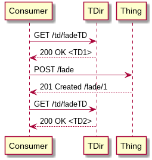
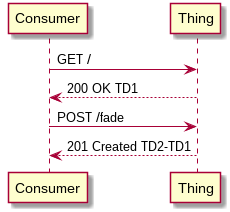

# Hypermedia Control on the Web of Things

This proposal introduces a generic hypermedia control framework for the Web of Things (WoT).

TL;DR:

- introduce new operation types `readaction`, `updateaction`, `cancelaction`, `readsubscription`, `updatesubscription`
- introduce new fields `cancellation`, `update` to action affordances and `update` to event affordances
- allow a TD document to include new forms as Consumers interact with the Thing
- specify a protocol or conventions to only send pieces of TD documents (e.g. newly included forms)

## Use Case Example

The following interface allows Consumers to invoke a `fade` action that can be updated or cancelled (see [original]() with JSON payloads):

```
POST /fade
GET /fade/{id}
PUT /fade/{id}
DELETE /fade/{id}
```

Here is a sequence diagram summarizing possible interactions:


With the current TD specification, a standard-compliant Consumer would be able to perform the first request but no subsequent request on the created resource. We assume the following TD is consumed by the Consumer:

```json
{
  "@context": "https://www.w3.org/2019/wot/td/v1",
  "id": "urn:ex:thing",
  "actions": {
    "fade": {
      "input": {
        "type": "number",
        "description": "duration in ms"
      },
      "forms": [
        {
          "href": "/fade",
          "op": "invokeaction"
        }
      ]
    }
  }
}
```

## Hypermedia Control & Affordances

Hypermedia control implies that the response a Thing sends to a Consumer may include indications of what operation the Consumer can perform next. This is what happen when it answers `201 Created /fade/1`, indicating a new resource can be operated on (`/fade/1`). What is missing though is the list of methods that this resource allows (`GET`, `PUT`, `DELETE`) and what effects they would have (update and cancellation of the invoked action).

A full description of what some operation does is what is called an **affordance** in the TD model. It guides a Consumer by specifying what happens if it performs this operation. Given that messages a Thing sends can embed affordances, a TD as the one above only includes _initial_ affordances to interact with the Thing while more affordances may be exposed later by the Thing.

In other words, the Consumer first learns about the following operation

```
POST /fade
```

and only after it performs that operation, it learns about other operations to perform:

```
GET /fade/{id}
PUT /fade/{id}
DELETE /fade/{id}
```

If a TD had to provide all possible series of interactions that can happen between a Consumer and a Thing, it would most likely be overwhelmed by irrelevant information before being able to simply invoke some action. This is the main argument in favor of applying hypermedia control to WoT.

The main idea of this proposal is to extend the TD model so that affordances can be exposed and consumed not just once but at any time in a series of interactions.

## Proposal: Piecewise Consumption of TDs

It is possible to model possible operations to `/fade/1` as TD forms, as follows:

```json
[
  {
    "href": "/fade/1",
    "htv:methodName": "GET"
  },
  {
    "href": "/fade/1",
    "htv:methodName": "PUT"
  },
  {
    "href": "/fade/1",
    "htv:methodName": "DELETE"
  }
]
```

These operations can be appended to the `forms` array of `fade` after the Thing creates the new resource.
As a baseline, a Consumer could (re)consume a TD every time no new affordance is made available, as in the following sequence with a Thing Directory (TDir):



In this sequence, TD1 is the original TD of the Thing and TD2 is a new TD that includes the 3 above forms. This configuration could be implemented for legacy systems whose interactions cannot be modified. It implies either that the TDir has a side channel to the Thing to know what resources were created or that the TDir acts as a proxy between the Consumer and the Thing.

Of course, such an exchange can be greatly optimized for Things that can comply to a TD v1.1, in the sense that a TD can be exposed piece by piece to a Consumer, as in the following sequence:



Here, TD2-TD1 (TD2 minus TD1) roughly corresponds to the array of forms newly created. A more specific protocol should be specified on how to exchange pieces of a TD, e.g. along the lines of [HTTP Range Requests](https://tools.ietf.org/html/rfc7233). With such a principle, the messages being effectively sent match current practices in RESTful API design that consist in sending short inline control data in responses, like `201 Created /fade/1`.

## Proposal: New Operation Types

The above proposal requires no change to the TD model. However, there is no `op` value that fits any of the newly created forms. While it is always possible that Things define their own operation types (and expose their definition on the Web under some URI, in RDF), these ones seem common and a future version of the TD model could include more `op` values, e.g. `readaction`, `updateaction`, `cancelaction`, with default method names (`GET`, `PUT` and `POST`, respectively).

These be able to provide (semantically annotated) schema for all these new operation types, action affordances could be extended as well by including `update`, `cancellation`, as in the following example:

```json
{
  "@context": "https://www.w3.org/2019/wot/td/v1",
  "id": "urn:ex:thing",
  "actions": {
    "fade": {
      "input": {
        "type": "number",
        "description": "duration (in ms)"
      },
      "output": {
        "type": "string",
        "description": "fade status (pending, running, done)"
      },
      "update": {
        "type": "number",
        "description": "new duration (in ms)"
      },
      "cancellation": {},
      "forms": [
        {
          "href": "/fade",
          "op": "invokeaction"
        },
        {
          "href": "/fade/1",
          "op": "readaction"
        },
        {
          "href": "/fade/1",
          "op": "updateaction"
        },
        {
          "href": "/fade/1",
          "op": "cancelaction"
        }
      ]
    }
  }
}
```

In this example, the output of the action is not the control data sent in the response to `POST /fade`. It is a representation of the action result in the physical world (see next section). It therefore corresponds to what is returned by `GET /fade/1`. _(TODO to clarify)_

To keep the different affordance types consistent with each other, one could also create `updatesubscription` as an operation type and add `update` to event affordances.

## Is Everything a Thing?

Another proposal to the general problem of hypermedia control on WoT was to return TDs as the result of invoking an action. The main drawback of this approach is that it would make any semantic concept a Thing, not only physical objects. Property, action and event affordances may also not refer to physical world entity anymore. The current proposal aims at keeping the necessary changes as small as possible while keeping the semantics of TDs clear. _(TODO to expand)_

## Extending to Event Histories

If a generic protocol to retrieve TDs piecewise is defined, it is then sufficient to add new operation types and some associated schema information. For instance, a `readhistory` operation type could be defined to get a history of events.
