# Reusable or Initial Connections


## Purpose of this folder

This folder contains a sandbox-like environment to work on the feature before it is integrated into the editor's draft.
Some tooling, tests with examples, proposal text are found here.

## TODOs

- Move the "Process Stakeholder" definitions somewhere:
  - Submitter: Entity who has submitted the user story, is interested in it, and thus wants this story to be successful.
  - Specification Writers: People from the TF who want to (or can) work on writing the specification text and corresponding resources.
  - Implementation Volunteers: People who want to implement this and contribute the results to the implementation report. The submitter is strongly encouraged to provide an implementation result.
  - Impacted: Entities who will be impacted by this user story. Impact type can be "implementation overhead", "security", "privacy", "accessibility", etc., and should be prefixed with `-` if it is a negative change, e.g., there is less implementation overhead but more privacy issues. Some lists to look at: <https://w3c.github.io/wot-usecases/#stakeholders>, <https://w3c.github.io/wot-security/#wot-threat-model-stakeholders>.

## User Stories

1. Connection Oriented Protocols

- **Who:** Deployer of devices with connection oriented protocols
- **What:** Reusable Connection descriptions in a TD
- **Why:** Better describe connection oriented protocols such as MQTT and WebSockets (Problem nb. 4 below)

- Sentence: **As a** deployer of devices with connection oriented protocols, **I need** reusable connection descriptions in a TD, **so that I can** better describe connection oriented protocols such as MQTT and WebSockets (Problem nb. 4 below)
- Process Stakeholders:
  - Submitter: Multiple
  - Specification Writers: Ege Korkan
  - Implementation Volunteers: Ege Korkan
  - Impacted People: TD Designers and Consumer application developers.
  - Impact Type: Less implementation overhead for TD Designers. More implementation overhead for Consumer application developers for building the request. Less implementation overhead when identifying protocol driver parameters.
- Linked Use Cases or Categories: https://w3c.github.io/wot-usecases/#UC-open-field-agriculture-1

2. Reusable Defaults per TD

- **Who:** Designer/Developer of TDs
- **What:** Reusable Connection descriptions in a TD
- **Why:** Simplify TDs in cases without usage of default terms or to avoid redundancy (Problem nb. 1, 2 and 3 below)

- Process Sentence: **As a** designer/developer of TDs, **I need** reusable connection descriptions in a TD, **so that I can** simplify TDs in cases without usage of default terms or to avoid redundancy (Problem nb. 1, 2 and 3 below).
- Stakeholders:
  - Submitter: Multiple
  - Specification Writers: Ege Korkan
  - Implementation Volunteers: Ege Korkan
  - Impacted: TD Designers and Consumers. Type: Implementation Overhead
- Linked Use Cases or Categories: Category "Ease of TD writing" to be created

## Summarized Problem

Currently, each form of an affordance has information on the endpoint, media type and other protocol related information.
It is possible to use the base term for simplifying the endpoint but it has limitations such as:

1. If the media type is common across forms but is not `application/json`, it is repeated in each form.
2. If there are common protocol stack configurations such as different default verbs, baud rates, and endianness, they are repeated in each form
3. Multiple bases are not possible. Thus, each form repeats multiple bases. This is relevant when a TD has local and public IP addresses
4. For protocols that are based on an initial connection and then subsequent messages, the semantics are not clear. Thus, a Consumer can establish multiple connections instead of reusing the initial connection. See the [Example of the Message Flow section](#examples-of-message-sequences) at the end of the document.

Related Issues:

- Umbrella Issue: <https://github.com/w3c/wot-thing-description/issues/1248>
- Media Type and Security Override: <https://github.com/w3c/wot-thing-description/issues/204>: Sharing a media type and security (already possible) among forms
- Single base with multiple protocols: <https://github.com/w3c/wot-thing-description/issues/803>: Having the same feature as the `security` term in form protocols
- Reused Connection: <https://github.com/w3c/wot-thing-description/issues/878>: Implying a first connection that is not dropped but actually reused later
- Out-of-band IP address: <https://github.com/w3c/wot-thing-description/issues/977>: Sort of related. Deducing the IP address from an out-of-band way
- Reused Connection in WS: <https://github.com/w3c/wot-thing-description/issues/1070>: Similar issue to 878 but giving more details on WebSocket
- Linking to Initial Connection: <https://github.com/w3c/wot-thing-description/issues/1242>: Similar issue to 803.
- Reused Connection in WS 2: <https://github.com/w3c/wot-thing-description/issues/1664>: Similar issue to 878 abd 1070
- Linking to Initial Connection 2: <https://github.com/w3c/wot-thing-description/issues/1834>: Similar issue to 803 and 1242

## Requirements

- There are 3 main points. Point 2 is about a keyword (more or less), whereas point 3 is more about the underlying mechanism.
  1. Having a place to put common connection information
  2. Linking to a common connection information.
  3. Signaling that a form in an affordance can reuse the connection established before so that the Consumer does not open a new connection per operation execution
- We want a global media type that behaves the same way as `security` in the root level, i.e. each form that does not have a `contentType` key, uses the one defined globally, somewhere in the root level of the TD. Relevant issues: https://github.com/w3c/wot-thing-description/issues/204 , https://github.com/w3c/wot-binding-templates/issues/357 . Points to pay attention:

  - In case of affordances that are incompatible with the global media type, overriding must be mandated. An unstructured data at root level, e.g. jpeg, must be overridden by an affordance that has data schema.
  - Negative: Message serialization from TD consumption will be more complex as a preprocessing of the TD is now needed. If there are multiple global media types, referring to them and resolving those will increase the complexity of the preprocessing step.
  - Positive: It is easier check for the Consumer, which media types (their decoder/encoder) are needed to be supported to talk to the Thing. Furthermore, as can be understood in the BACnet issue, it is currently not clear that a form requires a media type. This addition can help with this.
  - These negative and positive aspects will be visible in other points and can be named "tradeoffs". As mentioned in https://github.com/w3c/wot-thing-description/issues/803#issuecomment-526386771, any optimization of TD instances create more processing need while making them easier to understand and write by humans, at least in simpler cases.
  - Linking aspect is common to single connection and single base points

- We want to support multiple base URIs that behaves the same way as `securityDefinitions` in the root level, where each form can contain a relative URI and refer to a base, like we do now with `security`. Relevant issues: https://github.com/w3c/wot-thing-description/issues/803, https://github.com/w3c/wot-thing-description/issues/878 (starting at https://github.com/w3c/wot-thing-description/issues/878#issuecomment-598714052)

  - Proposals are available in #878: on the container structure called `connections`, `endpoints`: https://github.com/w3c/wot-thing-description/issues/878#issuecomment-924158987
  - Proposal about the container at https://github.com/w3c/wot-thing-description/issues/1070#issuecomment-815095825
  - Mention that canonical TDs can contain the expanded forms with everything doubled. This is applicable to global media type mentioned above.

- An initial connection to the Thing should be expressed somehow. This avoids misinterpretation of reopening a connection twice, when there is no need and gives correct semantics for some protocols. Relevant Issues: #878, #977, #1070, #1242, #1664

  - Proposals are available in #878 to:
    - have an `op` value called `open` or a signifier to establish a connection. Consensus from Sept15, 2021 is to not have an op. https://github.com/w3c/wot-thing-description/issues/878#issuecomment-920148181
    - `dependsOn` keyword in non-base forms
  - A proposal in #977 shows URL templating to refer to the base connection: https://github.com/w3c/wot-thing-description/issues/977#issuecomment-702397973
  - Proposal in https://github.com/w3c/wot-thing-description/issues/1070#issuecomment-815095825 for linking via pointers and has two proposals
  - The Consumer should be smart to not open new connections, even without this. This only makes it clearer for humans and simpler implementations.
  - There needs to be a way to signal a connection shared for multiple Things. See #1664.

- Wrapper Schemas comes into question if all communication over that initial connection follows the same message structure. Related issues https://github.com/w3c/wot-thing-description/issues/878#issuecomment-888433789. This is relevant to global media type and security in a way. Also relates to data mapping.

**Notes:**

- When to close the connection needs to be discussed.
- Complex security mechanisms exchange should be handled at the same time

## Basic mechanism


### Defaultable elements

An element that is defaultable has a container `{element}Def` at the root of the Thing that is a map of element of that kind.

Every element as a term `inherit` that points to a single element in `{element}Def`, if inherit is populated all the fields in the pointed element are used as default for the current element.

### Inlineable fields

A field may contain either a string pointing to an element in `{element}Def` or may contain the element of that kind itself.

### Thing-wide default

Fields that override the starting default for all the elements of that kind.

### Usage in the TD

`Form`, `Connection`, `DataSchema` and `Security` are **Defaultable Elements**. All the fields that can take one are **Inlineable fields**.

## Keywords and Types

### Thing Level

#### Thing-wide defaults

These set a default for the whole Thing. The mechanism is the same for all the terms, i.e. if the term has a string value, it is a reference and if it has an object value, it is an in-place definition.

| Vocabulary Term | Description                                                                                                      | Assignment | Type                                                                                                              | Remarks                                                                                                                         |
| --------------- | ---------------------------------------------------------------------------------------------------------------- | ---------- | ----------------------------------------------------------------------------------------------------------------- | ------------------------------------------------------------------------------------------------------------------------------- |
| security        | A reference to or an in-place definition of a Security                                                           | optional   | String pointing to the `securityDefinitions` map or Object with type `Security` (currently called SecurityScheme) | If string, it MUST refer to a first-level key in `securityDefinitions`. The array of strings of the TD 1.1 is not valid anymore |
| connection      | A reference to or an in-place definition of a Connection, if missing a protocol binding default is in place.     | optional   | String pointing to the `connectionDefinitions` map or Object with type `Connection`.                              | If string, it MUST refer to a first-level key in `connectionDefinitions`.                                                       |
| form            | A reference to or an in-place definition of a Form, if missing the affordance/operation-specific defaults apply. | optional   |                                                                                                                   | String pointing to the `formDefinitions` map or Object with type`Form`.                                                         |
| schema          | A reference to or an in-place definition of a Data Schema                                                        | optional   | String pointing to the `schemaDefinitions` map or Object with type `DataSchema`.                                  | If string, it MUST refer to a first-level key in `schemaDefinitions`.                                                           |

#### Definitions/Defaults container

| Vocabulary Term       | Description                                                                                                            | Assignment | Type                                    | Remarks                                                                    |
| --------------------- | ---------------------------------------------------------------------------------------------------------------------- | ---------- | --------------------------------------- | -------------------------------------------------------------------------- |
| securityDefinitions   | Set of named security configurations to be applied based on the presence of the `security` term                        | optional   | Map of Object with of type `Security`   | The first-level keys are free to choose by the TD producer. Same as TD 1.1 |
| connectionDefinitions | A set of connections that can be reused in forms to group common connection information such as a base URI or security | optional   | Map of Object with of type `Connection` | The first-level keys are free to choose by the TD producer. Same as TD 1.1 |
| formDefinitions       | A set of form information that can be referenced in a forms to group common form information such as `contentType`.    | optional   | Map of Object with of type `Form`       | The first-level keys are free to choose by the TD producer. Same as TD 1.1 |
| schemaDefinitions     | A set of Data Schemas to group common payload structures                                                               | optional   | Map of Object with of type `DataSchema` | The first-level keys are free to choose by the TD producer. Same as TD 1.1 |

Note: Even if a single form of an affordance is not complete, a defaultable element should exist.

### Elements

#### Overall Rules

- All of them contain `inherit`, which has type `String`
- Form can refer to a connection via `Form::connection`
- Connection can refer to a security `Connection::security`
- Form can refer to a schema via `Form::additionalResponse` (no change)
- Security can be overridden in a form using an inline definition for connection. No `security` term in the form level.
- Thing can refer to some forms in `Thing::forms`
- Security cannot refer to a connection, form or schema
- Connection cannot refer to a form or schema
- Schema cannot refer to anything beside itself, i.e. inheriting or `oneOf` etc.

#### Security

Same as now

#### Connection

| Vocabulary Term | Description                                                                                 | Assignment                     | Type                     | Remarks                                                                                                 |
| --------------- | ------------------------------------------------------------------------------------------- | ------------------------------ | ------------------------ | ------------------------------------------------------------------------------------------------------- |
| base            | The base URI that is used for building an absolute URI together with relative URIs in forms | optional                       | String of URI            | None                                                                                                    |
| security        | String pointing to the `securityDefinitions` map or Object with type `Security`             | SecurityDefinition (no change) | mandatory (TODO: Is it?) | When the security definition moves to the bindings, these terms can be moved a layer up to `connection` |

#### Form

| Vocabulary Term | Description                                                                                                                      | Assignment   | Type                                  | Remarks                                                                   |
| --------------- | -------------------------------------------------------------------------------------------------------------------------------- | ------------ | ------------------------------------- | ------------------------------------------------------------------------- |
| connection      | A reference to or an in-place definition of a connection definition                                                              | optional     |                                       | If a string, it MUST refer to a first-level key in `connectionDefinitions`. |
| op              | Indicates the semantic intention of performing the operation(s) described by the form.                                           | with default | String or Array of Strings (no change) |                                                                           |
| contentType     | Assign a content type based on a media type (e.g., `text/plain`) and potential parameters (e.g., `charset=utf-8`) for the media type | with default | String (no change)                    |                                                                           |

#### Schema

Same as now

## Guidelines

hints for designing TDs. When to use this or not.

1. If you have one mechanism (security, connection, form, schema), just inline it.

- Security term at the top level is optional
  - McCool not mandatory -> Reducing verbosity, make TDs simpler and shorter. People say it is annoying and does not improve security. Defining a "useless" security at the top and always overwriting it is not clear.
- No resolution: Having no security field at all (none in the forms, none in the top level) -> reverting to defaults
- No resolution: Security defaults:
  - McCool auto -> Assuming nosec is wrong assumption

TODO: Documenting why we have multi sec for one Thing. Some properties being public, some not. Reading being public, writing not.

### Validation Rules

- Reference for an object that doesn't exist: What happens in TD 1.1 is same here.

## Algorithm

TODO: Discuss flattening, normalization and canonicalization algorithm should take the connection

Each TD form MUST be expanded before using its information in a protocol driver. It does repeat until the there is no populated `inherit`. (single inheritance)

To expand the form in an affordance:

- Check if there is a `connection` or a `form` available. If neither is present, check if there is a top-level `connection` or a `form` available. If neither is present, this form is complete and can be used in a binding driver.

## Examples

You can find example TDs at [tooling/td.js](./tooling/tds.js)

### TD Examples

1. One Connection, one Form, one security no definitions

1.a Defaults separate

```js
{
  "title": "test",
  "connection":{
      "base": "https://example.com"
  },
  "form":{
      "contentType":"application/json"
  },
  "security":{
      "scheme":"nosec"
  },
  "properties": {
    "prop1": {
     "type":"string",
     "forms": [
      {
       "href": "/props/prop1"
      }
     ]
   },
   "prop2": {
    "type":"string",
    "forms": [
      {
       "href": "/props/prop2"
      }
    ]
   }
  }
}
```

1.b Only with form

```js
{
  "title": "test",
  "form":{
      "contentType":"application/json",
      "connection":{
          "base": "https://example.com",
          "security":{
            "scheme":"nosec"
          }
      }
  },
  "properties": {
    "prop1": {
     "type":"string",
     "forms": [
      {
       "href": "/props/prop1"
      }
     ]
   },
   "prop2": {
    "type":"string",
    "forms": [
      {
       "href": "/props/prop2"
      }
    ]
   }
  }
}
```

2. Equivalent Example to above, just more verbose

```js
{
  "title": "test",
  "connectionDefinitions": {
    "conn1" : {
      "base": "https://example.com"
      // "security":"sec1" can be added here instead. We should recommend since there is only one.
    }
  },
  "formDefinitions":{
      "form1": {
        "contentType":"application/json",
        // "connection":"conn1" can be added here instead. We should recommend since there is only one.
      }
  },
  "securityDefinitions":{
      "sec1":{
          "scheme":"nosec"
      }
  },
  "connection": "conn1",
  "form":"form1",
  "security":"sec1", // This applies to all connections
  "properties": {
    "prop1": {
     "type":"string",
     "forms": [
      {
       "href": "/props/prop1"
      }
     ]
   },
   "prop2": {
    "type":"string",
    "forms": [
      {
       "href": "/props/prop2"
      }
    ]
   }
  }
}
```

3. Equivalent Example to above without reuse (same as TD 1.0 but with security in form)

```js
{
  "title": "test",
  "properties": {
    "prop1": {
     "type":"string",
     "forms": [
      {
       "href": "https://example.com/props/prop1",
       "connection":{
           "security":{"scheme":"nosec"}
       }, // this is possible but we want to flatten
       "contentType":"application/json"
      }
     ]
   },
   "prop2": {
    "type":"string",
    "forms": [
      {
       "href": "https://example.com/props/prop2",
       // applying flattening, we would get this
       "security":{"scheme":"basic"},
       "contentType":"application/json"
      }
    ]
   }
  }
}
```

4. Equivalent Example to above without defaults

4.a Completely flat

```js
{
  "title": "test",
  "securityDefinitions":{
    "sec1":{
      "scheme":"nosec"
    }
  },
  "connectionDefinitions": {
    "conn1" : {
      "base": "https://example.com"
    }
  },
  "formDefinitions":{
      "form1": {
        "contentType":"application/json"
      }
  },
  "properties": {
    "prop1": {
     "type":"string",
     "forms": [
      {
       "connection":"conn1",
       "form":"form1",
       "security":"sec1",
       "href": "/props/prop1"
      }
     ]
   },
   "prop2": {
    "type":"string",
    "forms": [
      {
       "connection":"conn1",
       "form":"form1",
       "security":"sec1",
       "href": "/props/prop2"
      }
    ]
   }
  }
}
```

4.b Definition-level reusage

```js
{
  "title": "test",
  "securityDefinitions":{
      "sec1":{
          "scheme":"nosec"
      }
  },
  "connectionDefinitions": {
    "conn1" : {
      "security":"sec1",
      "base": "https://example.com"
    }
  },
  "formDefinitions":{
      "form1": {
        "connection":"conn1",
        "contentType":"application/json"
      }
  },
  "properties": {
    "prop1": {
     "type":"string",
     "forms": [
      {
       "form":"form1",
       "href": "/props/prop1"
      }
     ]
   },
   "prop2": {
    "type":"string",
    "forms": [
      {
       "form":"form1",
       "href": "/props/prop2"
      }
    ]
   }
  }
}
```

5. Requiring more security for writing

```js
{
  "title": "test",
  "connectionDefinitions": {
    "conn1" : {
      "base": "https://example.com"
    }
  },
  "formDefinitions":{
      "form1": {
        "contentType":"application/json"
      }
  },
  "securityDefinitions":{
      "sec1":{
          "scheme":"nosec"
      },
      "sec2":{
          "scheme":"basic"
      }
  },
  "connection": "conn1",
  "form":"form1",
  "security":"sec1",
  "properties": {
    "prop1": {
     "type":"string",
     "forms": [
      {
       "href": "/props/prop1",
       "op":"readproperty"
      },
      {
       "href": "/props/prop1",
       "op":"writeproperty",
       "connection":{
          "inherit":"conn1",
          "security":"sec2"
       }
      }
     ]
   },
   "prop2": {
    "type":"string",
    "forms": [
      {
       "href": "/props/prop2"
      }
    ]
   }
  }
}
```

```
{
  connection: "something",
  op: "readproperty"
},
{
  connection: "something-strict",
  op: "writeproperty"
}
```

### TD Examples with State Machines for MQTT and WS

TODO

## How to combine with TMs

TODO

## Examples of Message Sequences

### Simple HTTP Connection

#### Participating Entities

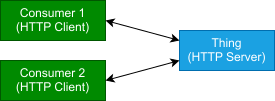

In this case, the Thing has enough resources and contains its own HTTP server.

#### Lifecycle of a Connection

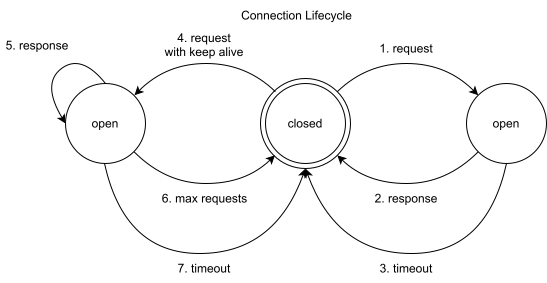

1. A request from the client opens the connection to the server.
2. A response from the server back to the client closes the connection.
3. If the server provides no response in a given time interval, a timeout occurs and the connection is closed.
4. Alternatively, a request can be sent with Keep Alive parameters (timeout and max requests parameters).
5. In this case, the responses back to the client will not close the connection.
6. If a certain amount of requests have been sent, the connection will be closed.
7. If a certain time is reached, the connection will be closed.

#### Message Sequence


We note that even with Keep Alive option set, the interaction pattern do not change in the application level.
Thus, keep alive can be seen as an optimization and not a different way to interact.

### Broker Connections without Security

#### Participating Entities

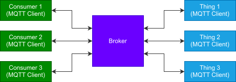

Typically, the broker is a separate entity than the Thing.

#### Lifecycle of a Connection

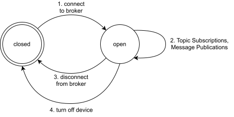

1. A client connects to the broker and opens a consistent connection.
2. Client can subscribe or publish to topics as long as the connection is active.
3. Client can disconnect from the broker and close the connection.
4. If the device turns off or has an error, the connection can be closed.

#### Lifecycle of a Subscription

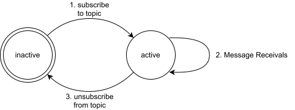

1. A Client already connected to the broker (open connection), can subscribe to a topic where that subscription becomes active.
2. Multiple messages can be received while the subscription is active.
3. Once the client unsubscribes from the topic, the subscription becomes inactive.

#### Message Sequence


We note that, even after a time has passed, the connection stays open and the subscription stays active.
The client id is used in a connection but is typically not exposed to the application layer.

### Basic WebSocket Connections

#### Participating Entities


In this case, the Thing has enough resources and contains its own WebSocket server.

#### Lifecycle of a Connection

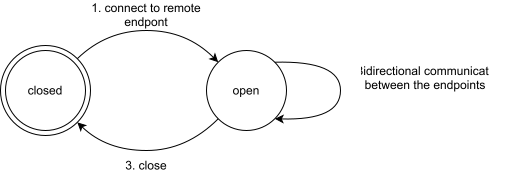

The lifecycle of a WebSocket connection in the Web of Things typically includes the following stages:

1. **Connection Establishment**: The client initiates a handshake request to the server, which responds with a handshake response, establishing a persistent connection.
2. **Data Transmission**: Once connected, the client and server can exchange data bi-directionally in real-time, with messages sent as frames. This may include ping/pong frames to keep understand connection "liveness" between the parties.
3. **Connection Closure**: Either party can initiate the closing handshake by sending a close frame, after which the connection is terminated, and resources are released.

#### Message Sequence

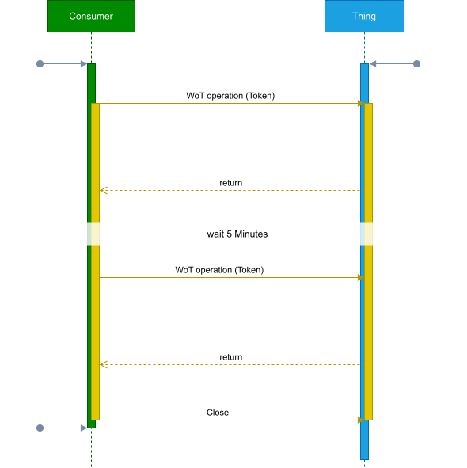

### OAuth2-based Interaction

#### Participating Entities

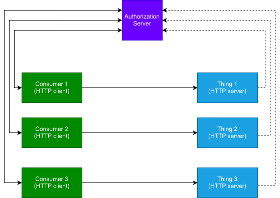

In this case, the Thing has enough resources and contains its own HTTP server.

#### Lifecycle of a Session

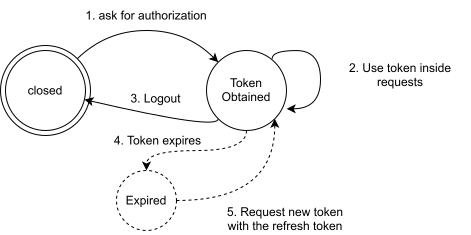

The lifecycle of an OAuth token in a session involves the following stages:

1. **Token Request and authorization**: The client requests an access token from the authorization server, typically after authenticating and obtaining user consent.
2. **Token Use**: The client uses the access token to access protected resources on the resource server by including it in API requests.
3. **Logout**: The client or authorization server can revoke tokens to terminate the session, preventing further access.
4. **Token Expiry and Refresh**: Access tokens are time-limited. If a refresh token is available, the client can request a new access token without user reauthorization.

#### Message Sequence

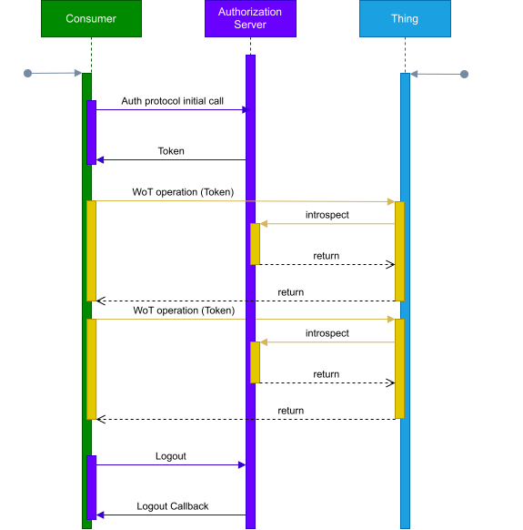

### Proxy-based Communication

#### Participating Entities

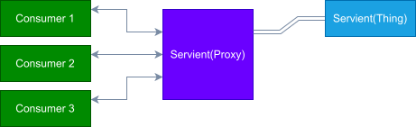

In this case, the Thing has enough resources and contains its own HTTP server.

#### Lifecycle of a Connection

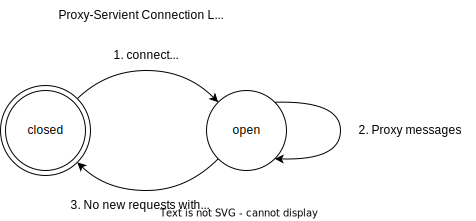

#### Message Sequence

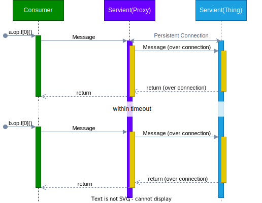
