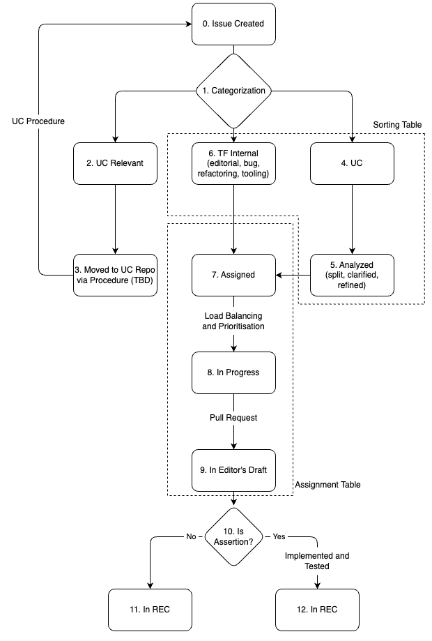

# WoT Project Management Process

> [!NOTE]  
> Proposal Status: Accepted

The main question to answer is "How do we organize the work?".
We want to have one place to look for the list of "work" to do in a short period.
To do that, a prioritization should happen and should be aligned with use cases and requirements.
This allows us to limit the load of a person per 1-2 week time frame and thus prioritize certain issues/topics.

## Current Process

- We have a table in a GitHub project managed by the TD TF
- Once the TF is comfortable with the approach, no other information is needed. Until then, the lifecycle diagram below represents how the work goes through over time.

- **Step 0:** An issue shows up.
- **Step 1:** The TF acts fast to categorize and refine it. The steps are detailed below and reflected also in the sorting table example towards the end. Step 2, 3 or 4 is picked based on categorization in this step. The initial categorization can happen outside of the calls but issues that need thorough analysis and refinement would typically in a meeting.
  1. **Left Path:** The issue is identified to have Use Case relevant content where a deeper understanding is needed. In **Step 2** It is moved to the Use Cases repository.
  2. **Right Path:** The issue is created by the Use Cases TF. In **Step 3** the TD TF analyzes it, which can result in smaller issues, more description etc. This is also reflected in the sorting table. Note that this is closely related with the [Use Cases Process](https://github.com/w3c/wot-usecases/blob/main/Process.md) where the result of the gap analysis and feature definition are the inputs to this point.
  3. **Middle Path:** The issue is identified to be handled by the TF alone. These are issues about tooling, editorial fixes, etc. The TF labels it and moves it to the relevant column in the sorting table.
- Note: During the refinement of an issue (understanding, labeling) in step 3 or step 4, it is placed in a column in the sorting table based on the category. Categories such as `bindings`, `data mapping`, `tooling`, which are [work items](https://github.com/w3c/wot/blob/main/planning/ThingDescription/work-items.md) (big topics), are separate a columns. Categories such as `editorial`, `bug` are grouped in one column called `other`.
- **Step 4:** The issue is assigned to one or more persons based on who is most suited, has more motivation etc. but not based on their availability.
- **Step 5:** Based on people's availabilities and priorities set by the TF and WG as a whole, the issue is moved to "in progress". This indicates that this issue is being addressed by one or more persons and is part of the agenda until resolved.
  - Note: We need further discussion on how we prioritize items.
- **Step 6:** The result of the work happens in a Pull Request to the Editor's Draft. In that stage, the issue is moved to "In Review". The Pull Request can be merged asynchronously based on the agreement in the [WG Policy](https://github.com/w3c/wot/blob/main/policies/async-decision.md). Once it is merged, it is part of the Editor's Draft and the issue is closed and removed from the board.
- **Step 7:** Based on the nature of the change , it can require implementations to demonstrate implementability.
  - **Step 8:** If the change is an RFC assertion, we need to show its implementability before it can be in the final REC.
  - **Step 9:** If not, it can be in the REC without any further effort. Note that in both cases the WG needs to reach consensus or in the case of REC-track documents, the entire W3C needs to support it as part of the deliverable.

The lifecycle is also reflected in a table below. The example below can be considered a snapshot of the project management process.

- New issues come on the "Unsorted" column. Here we see Issue 21.
- After categorization, an issue can get corresponding labels and placed in "Categorized - Not assigned" column. This means that someone from the TF had a look at the issue and put the corresponding labels.
- We see that a person can get assigned to an issue since they are the best fit (more expertise, more motivation etc.) but is not necessarily doing it right now, shown in column "Assigned". Since Person2 has less availability, they are working only on Issue 10 while Issues 7 and 9 are on hold.
- Person1 has more time and is working on Issues 5 and 6 as indicated in column "In Progress", while having assigned Issue 4 as well.
- Issues 11 and 13 are currently under review and have an associated Pull Request.
- Issue 1 is in the parking lot since it is not being actively discussed after some initial discussions.
- Once an issue is closed, it is moved to "Done" column which is hidden from view.

## To Do

- Create issue templates for necessary items

## Archive

### Opinions

- Ege Korkan:
  - Ideally, we should discuss our requirements and what people want to see. Mandating a mechanism that the moderators like but is disliked by everyone else should be avoided.
  - The goal is to make it more systematic than "copy-pasting the agenda, look into issues and PRs"
  - The process for generating features from use cases should be taken into account
  - We can use a tool like GitHub Projects. A premature example is available at <https://github.com/orgs/w3c/projects/31> (this project is now deleted and an up to date one is available at <https://github.com/orgs/w3c/projects/80>)
- Mahda Noura: Only assigning an issue is not enough, because the number can increase and we can lose oversight/prioritization.
- Cristiano Aguzzi: Assigning should happen when you know that person can do it in 1-2 weeks.
- Jan Romann: Splitting issues definitely helps. We should limit the workload of an issue in the beginning or use checkboxes per small item and open a "spinoff" issue.
- Kazuyuki Ashimura: We should think of what we have been doing so far.
