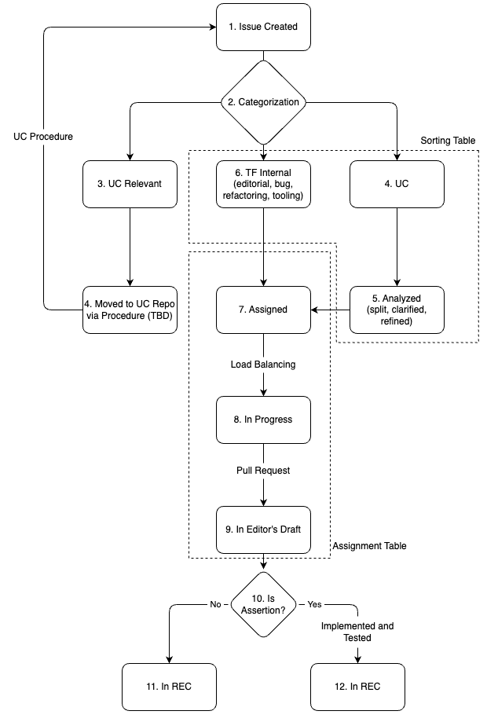

# Project Management Process

The text below is copied from <https://www.w3.org/WoT/IG/wiki/index.php?title=WG_WoT_Thing_Description_WebConf>.

The main question is "How do we organize the work?". 

## Opinions

- Ege Korkan:
  - Ideally, we should discuss our requirements and what people want to see. Mandating a mechanism that the moderators like but is disliked by everyone else should be avoided.
  - The goal is to make it more systematic than "copy-pasting the agenda, look into issues and PRs"
  - The process for generating features from use cases should be taken into account
  - We can use a tool like GitHub Projects. A premature example is available at https://github.com/orgs/w3c/projects/31
- Mahda Noura: Only assigning an issue is not enough, because the number can increase and we can lose oversight/prioritization.
- Cristiano Aguzzi: Assigning should happen when you know that person can do it in 1-2 weeks.
- Jan Romann: Splitting issues definitely helps. We should limit the workload of an issue in the beginning or use checkboxes per small item and open a "spinoff" issue.
- Kazuyuki Ashimura: We should think of what we have been doing so far.

## Proposals

**Preliminary goal from meetings:**

- An MVP is one place to look at the list of "work" to do in a short period. We can make sure to limit the load of a person per 1-2 week timeframe and thus prioritize certain issues/topics.
- A prioritization should happen and should be aligned with use cases and requirements, i.e. how do we choose the small list of work to do

### Proposal from Ege Korkan

- Create three tables in a GitHub project: Extraction, Sorting and Assigning
- Use the sorting table to categorize issues into topics we agree on via work item categories, i.e. `bindings`, `data mapping`, where each category is a column. The granularity of categories is to be discussed. The backlog of this table is uncategorized issues. This table is edited primarily outside of the calls, i.e. as issue or use case shows up.
  - First an issue comes from the use case pipeline (extraction table). This issue is a short feature proposal that needs to satisfy a set of requirements. It is possible that the work to satisfy the requirement is a lot. The TF should work on planning the work to fit the TF structure and the spec generation pipeline. Ideally, it should be split into multiple issues that are easy to manage, assignable as tasks and that do not result in very big PRs.
- Use Assignment table to track who is most suited for the issue and whether that is being worked on. Based on people's availabilities, move issues to "in progress". The backlog of this table is categorized issues. This table is edited primarily during calls.
- Use extraction table for dealing with use cases. After a process (to be defined) there should be concrete issues created. The backlog of this table is use cases, the product is uncategorized issues for the sorting table. They can be categorized already in this stage and moved to the correct column in the sorting table.

This proposal is illustrated in the figure below:

Here we see that no issue that is not categorized is in the assignment table, i.e. issues 1, 2 and 3.
Also, we see that a person can get assigned to issue since they are the best fit (more expertise, more motivation etc.) but is not necessarily doing it right now.
Since Person2 has less availability, they are working only on Issue 10 while having Issue 7 and 9 assigned to them.
Person1 has more time and is working Issue 5 and 6, while having assigned Issue 4 as well.

## Procedure

Concrete procedure text will come here.

## To Do

- We should analyze https://github.com/w3c/strategy/projects/2 and https://github.com/orgs/w3c/projects/13
- Create issue templates for necessary items
